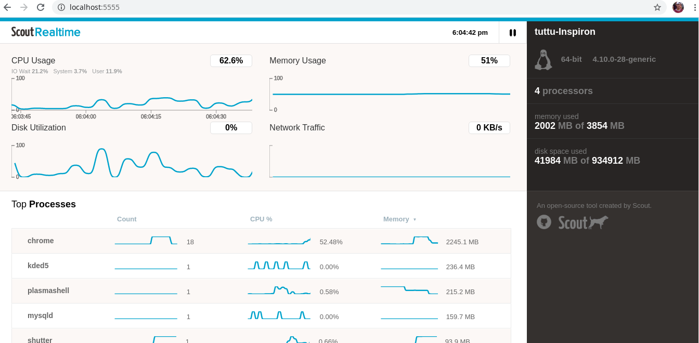

> Scout_Realtime is a simple, easy-to-use web based tool for monitoring Linux server metrics in real-time, in a top-like fashion. It shows you smooth-flowing charts about metrics gathered from the CPU, memory, disk, network, and processes (top 10), in real-time.

To install scout_real time tool in ububtu based systems
To install scout_realtime on your Linux server, you must have Ruby 1.9.3+ installed on your server. If it is not installed you can do it using following command.
```
apt-get install rubygems
```

> Then run the following command to install scout_real time tool
```
gem install scout_realtime
```
> After successfully installing scout_realtime package, next, you need to start the scout_realtime daemon which will collect server metrics in real-time as shown.
```
# scout_realtime 

Daemon has started successfully
To view in your browser, do ONE of the following:

A) create an SSH tunnel: ssh -NL 5555:localhost:5555 user@ip_or_hostname (run that command on your own computer, not the server)
   then point your browser to: http://localhost:5555
   --- OR ---
B) open a port in your firewall: sudo iptables -A INPUT -p tcp --dport 5555 -j ACCEPT (run that command on your server)
   then point your browser to: http://your-ip-or-hostname:5555

* FYI, the log file is: /root/.scout/scout_realtime.log
* "scout_realtime stop" to stop the daemon
```

> Now that the scout_realtime daemon is running on your Linux server that you want to monitor remotely on port 5555. If you are running a firewall, you need to open the port 5555 which scout_realtime listens on, in the firewall to allow requests to it.

```
---------- On Debian/Ubuntu ----------
$ sudo ufw allow 27017  
$sudo ufw reload 

---------- On RHEL/CentOS 6.x ----------
$ sudo iptables -A INPUT -p tcp --dport 5555 -j ACCEPT    
$ sudo service iptables restart

---------- On RHEL/CentOS 7.x ----------
$ sudo firewall-cmd --permanent --add-port=5555/tcp       
$ sudo firewall-cmd reload 
```

>  Now from any other machine, open a web browser and use the URL below to access the scout_realtime to monitor your remote Linux server performance.
```
http://localhost:5555 
OR
http://ip-address-or-domain.com:5555 
```


 

